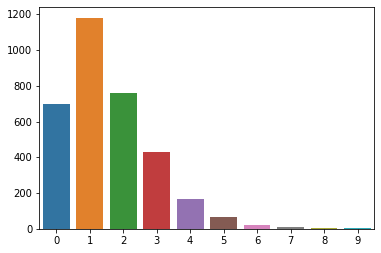

# Final Project Submission for Mod 3


* Student name: **Andrew Hotchkiss**
* Student pace: **Part time**
* Scheduled project review date/time: **10/10/20 @ 1:30pm**
* Instructor name: **James Irving**
* Blog post URL: https://stones-1130.github.io/


## TABLE OF CONTENTS 

*Click to jump to matching Markdown Header.*<br><br>

<font size=3rem>
    
- **[Introduction](#INTRODUCTION)<br>**
- **[OBTAIN](#OBTAIN)**<br>
- **[SCRUB](#SCRUB)**<br>
- **[EXPLORE](#EXPLORE)**<br>
- **[MODEL](#MODEL)**<br>
- **[iNTERPRET](#iNTERPRET)**<br>
- **[Conclusions/Recommendations](#CONCLUSIONS-&-RECOMMENDATIONS)<br>**
</font>
___

# INTRODUCTION

> **Assignment:** 
> - *Build a binary classifier to predict whether a customer will ("soon") stop doing business with SyriaTel, a telecommunications company.* 
> - *Identify and explain factors that predict if the customer will "stick around" with the company or is likely to cancel their plan in the near future.*

> This is concept is typically called **"customer churn"**, defined as the proportion of contractual customers or subscribers who leave a supplier during a given time period. It is a possible indicator of customer dissatisfaction, cheaper and/or better offers from the competition, more successful sales and/or marketing by the competition, or reasons having to do with the customer life cycle.

source: https://en.wikipedia.org/wiki/Churn_rate


# OBTAIN


```python
import pandas as pd
import numpy as np
import matplotlib.pyplot as plt
import seaborn as sns
%matplotlib inline
```


```python
df = pd.read_csv('customer_churn.csv')
df.head()
```


<div>
<style scoped>
    .dataframe tbody tr th:only-of-type {
        vertical-align: middle;
    }

    .dataframe tbody tr th {
        vertical-align: top;
    }

    .dataframe thead th {
        text-align: right;
    }
</style>
<table border="1" class="dataframe">
  <thead>
    <tr style="text-align: right;">
      <th></th>
      <th>state</th>
      <th>account length</th>
      <th>area code</th>
      <th>phone number</th>
      <th>international plan</th>
      <th>voice mail plan</th>
      <th>number vmail messages</th>
      <th>total day minutes</th>
      <th>total day calls</th>
      <th>total day charge</th>
      <th>...</th>
      <th>total eve calls</th>
      <th>total eve charge</th>
      <th>total night minutes</th>
      <th>total night calls</th>
      <th>total night charge</th>
      <th>total intl minutes</th>
      <th>total intl calls</th>
      <th>total intl charge</th>
      <th>customer service calls</th>
      <th>churn</th>
    </tr>
  </thead>
  <tbody>
    <tr>
      <td>0</td>
      <td>KS</td>
      <td>128</td>
      <td>415</td>
      <td>382-4657</td>
      <td>no</td>
      <td>yes</td>
      <td>25</td>
      <td>265.1</td>
      <td>110</td>
      <td>45.07</td>
      <td>...</td>
      <td>99</td>
      <td>16.78</td>
      <td>244.7</td>
      <td>91</td>
      <td>11.01</td>
      <td>10.0</td>
      <td>3</td>
      <td>2.70</td>
      <td>1</td>
      <td>False</td>
    </tr>
    <tr>
      <td>1</td>
      <td>OH</td>
      <td>107</td>
      <td>415</td>
      <td>371-7191</td>
      <td>no</td>
      <td>yes</td>
      <td>26</td>
      <td>161.6</td>
      <td>123</td>
      <td>27.47</td>
      <td>...</td>
      <td>103</td>
      <td>16.62</td>
      <td>254.4</td>
      <td>103</td>
      <td>11.45</td>
      <td>13.7</td>
      <td>3</td>
      <td>3.70</td>
      <td>1</td>
      <td>False</td>
    </tr>
    <tr>
      <td>2</td>
      <td>NJ</td>
      <td>137</td>
      <td>415</td>
      <td>358-1921</td>
      <td>no</td>
      <td>no</td>
      <td>0</td>
      <td>243.4</td>
      <td>114</td>
      <td>41.38</td>
      <td>...</td>
      <td>110</td>
      <td>10.30</td>
      <td>162.6</td>
      <td>104</td>
      <td>7.32</td>
      <td>12.2</td>
      <td>5</td>
      <td>3.29</td>
      <td>0</td>
      <td>False</td>
    </tr>
    <tr>
      <td>3</td>
      <td>OH</td>
      <td>84</td>
      <td>408</td>
      <td>375-9999</td>
      <td>yes</td>
      <td>no</td>
      <td>0</td>
      <td>299.4</td>
      <td>71</td>
      <td>50.90</td>
      <td>...</td>
      <td>88</td>
      <td>5.26</td>
      <td>196.9</td>
      <td>89</td>
      <td>8.86</td>
      <td>6.6</td>
      <td>7</td>
      <td>1.78</td>
      <td>2</td>
      <td>False</td>
    </tr>
    <tr>
      <td>4</td>
      <td>OK</td>
      <td>75</td>
      <td>415</td>
      <td>330-6626</td>
      <td>yes</td>
      <td>no</td>
      <td>0</td>
      <td>166.7</td>
      <td>113</td>
      <td>28.34</td>
      <td>...</td>
      <td>122</td>
      <td>12.61</td>
      <td>186.9</td>
      <td>121</td>
      <td>8.41</td>
      <td>10.1</td>
      <td>3</td>
      <td>2.73</td>
      <td>3</td>
      <td>False</td>
    </tr>
  </tbody>
</table>
<p>5 rows × 21 columns</p>
</div>


> **Data Dictionary:**

**state: the state the user lives in**

**account length: the number of days the user has had this account**

**area code: the user's three-digit telephone area code** 

**phone number: the user's phone number**

**international plan: true if the user has the 
international plan, otherwise false**

**voice mail plan: true if the user has the voice mail plan, otherwise false**

**number vmail messages: the number of voice mail messages the user has in their inbox**

**total day minutes: the user's total number of call minutes during the day**

**total day calls: the user's total number of calls during the day**

**total day charge: total amount of money the user was charged by SyriaTel for calls during the day**

**total eve minutes: the user's total number of call minutes during the evening**

**total eve calls: the user's total number of calls during the evening**

**total eve charge: total amount of money the user was charged by SyriaTel for calls during the evening**

**total night minutes: the user's total number of call minutes during the night**

**total night calls: the user's total number of calls during the night**

**total night charge: total amount of money the user was charged by SyriaTel for calls during the night**

**total intl minutes: the user's total number of call minutes from international calls**

**total intl calls: the user's total number of international calls**

**total intl charge: total amount of money the user was charged by SyriaTel for international calls**

**customer service calls: the user's total number of customer service calls**

**churn: true if the user terminated their contract with SyriaTel, otherwise false**

source: https://www.kaggle.com/ambpro/dealing-with-unbalance-eda-pca-smote-lr-svm-dt-rf

# EXPLORE


```python
#EXAMINE THE DATA TYPES, ALSO LOOK FOR MISSING DATA

display(df.info(), df.describe(), df.isna().sum(), df.shape)
```

    <class 'pandas.core.frame.DataFrame'>
    RangeIndex: 3333 entries, 0 to 3332
    Data columns (total 21 columns):
    state                     3333 non-null object
    account length            3333 non-null int64
    area code                 3333 non-null int64
    phone number              3333 non-null object
    international plan        3333 non-null object
    voice mail plan           3333 non-null object
    number vmail messages     3333 non-null int64
    total day minutes         3333 non-null float64
    total day calls           3333 non-null int64
    total day charge          3333 non-null float64
    total eve minutes         3333 non-null float64
    total eve calls           3333 non-null int64
    total eve charge          3333 non-null float64
    total night minutes       3333 non-null float64
    total night calls         3333 non-null int64
    total night charge        3333 non-null float64
    total intl minutes        3333 non-null float64
    total intl calls          3333 non-null int64
    total intl charge         3333 non-null float64
    customer service calls    3333 non-null int64
    churn                     3333 non-null bool
    dtypes: bool(1), float64(8), int64(8), object(4)
    memory usage: 524.2+ KB


    None


<div>
<style scoped>
    .dataframe tbody tr th:only-of-type {
        vertical-align: middle;
    }

    .dataframe tbody tr th {
        vertical-align: top;
    }

    .dataframe thead th {
        text-align: right;
    }
</style>
<table border="1" class="dataframe">
  <thead>
    <tr style="text-align: right;">
      <th></th>
      <th>account length</th>
      <th>area code</th>
      <th>number vmail messages</th>
      <th>total day minutes</th>
      <th>total day calls</th>
      <th>total day charge</th>
      <th>total eve minutes</th>
      <th>total eve calls</th>
      <th>total eve charge</th>
      <th>total night minutes</th>
      <th>total night calls</th>
      <th>total night charge</th>
      <th>total intl minutes</th>
      <th>total intl calls</th>
      <th>total intl charge</th>
      <th>customer service calls</th>
    </tr>
  </thead>
  <tbody>
    <tr>
      <td>count</td>
      <td>3333.000000</td>
      <td>3333.000000</td>
      <td>3333.000000</td>
      <td>3333.000000</td>
      <td>3333.000000</td>
      <td>3333.000000</td>
      <td>3333.000000</td>
      <td>3333.000000</td>
      <td>3333.000000</td>
      <td>3333.000000</td>
      <td>3333.000000</td>
      <td>3333.000000</td>
      <td>3333.000000</td>
      <td>3333.000000</td>
      <td>3333.000000</td>
      <td>3333.000000</td>
    </tr>
    <tr>
      <td>mean</td>
      <td>101.064806</td>
      <td>437.182418</td>
      <td>8.099010</td>
      <td>179.775098</td>
      <td>100.435644</td>
      <td>30.562307</td>
      <td>200.980348</td>
      <td>100.114311</td>
      <td>17.083540</td>
      <td>200.872037</td>
      <td>100.107711</td>
      <td>9.039325</td>
      <td>10.237294</td>
      <td>4.479448</td>
      <td>2.764581</td>
      <td>1.562856</td>
    </tr>
    <tr>
      <td>std</td>
      <td>39.822106</td>
      <td>42.371290</td>
      <td>13.688365</td>
      <td>54.467389</td>
      <td>20.069084</td>
      <td>9.259435</td>
      <td>50.713844</td>
      <td>19.922625</td>
      <td>4.310668</td>
      <td>50.573847</td>
      <td>19.568609</td>
      <td>2.275873</td>
      <td>2.791840</td>
      <td>2.461214</td>
      <td>0.753773</td>
      <td>1.315491</td>
    </tr>
    <tr>
      <td>min</td>
      <td>1.000000</td>
      <td>408.000000</td>
      <td>0.000000</td>
      <td>0.000000</td>
      <td>0.000000</td>
      <td>0.000000</td>
      <td>0.000000</td>
      <td>0.000000</td>
      <td>0.000000</td>
      <td>23.200000</td>
      <td>33.000000</td>
      <td>1.040000</td>
      <td>0.000000</td>
      <td>0.000000</td>
      <td>0.000000</td>
      <td>0.000000</td>
    </tr>
    <tr>
      <td>25%</td>
      <td>74.000000</td>
      <td>408.000000</td>
      <td>0.000000</td>
      <td>143.700000</td>
      <td>87.000000</td>
      <td>24.430000</td>
      <td>166.600000</td>
      <td>87.000000</td>
      <td>14.160000</td>
      <td>167.000000</td>
      <td>87.000000</td>
      <td>7.520000</td>
      <td>8.500000</td>
      <td>3.000000</td>
      <td>2.300000</td>
      <td>1.000000</td>
    </tr>
    <tr>
      <td>50%</td>
      <td>101.000000</td>
      <td>415.000000</td>
      <td>0.000000</td>
      <td>179.400000</td>
      <td>101.000000</td>
      <td>30.500000</td>
      <td>201.400000</td>
      <td>100.000000</td>
      <td>17.120000</td>
      <td>201.200000</td>
      <td>100.000000</td>
      <td>9.050000</td>
      <td>10.300000</td>
      <td>4.000000</td>
      <td>2.780000</td>
      <td>1.000000</td>
    </tr>
    <tr>
      <td>75%</td>
      <td>127.000000</td>
      <td>510.000000</td>
      <td>20.000000</td>
      <td>216.400000</td>
      <td>114.000000</td>
      <td>36.790000</td>
      <td>235.300000</td>
      <td>114.000000</td>
      <td>20.000000</td>
      <td>235.300000</td>
      <td>113.000000</td>
      <td>10.590000</td>
      <td>12.100000</td>
      <td>6.000000</td>
      <td>3.270000</td>
      <td>2.000000</td>
    </tr>
    <tr>
      <td>max</td>
      <td>243.000000</td>
      <td>510.000000</td>
      <td>51.000000</td>
      <td>350.800000</td>
      <td>165.000000</td>
      <td>59.640000</td>
      <td>363.700000</td>
      <td>170.000000</td>
      <td>30.910000</td>
      <td>395.000000</td>
      <td>175.000000</td>
      <td>17.770000</td>
      <td>20.000000</td>
      <td>20.000000</td>
      <td>5.400000</td>
      <td>9.000000</td>
    </tr>
  </tbody>
</table>
</div>


    state                     0
    account length            0
    area code                 0
    phone number              0
    international plan        0
    voice mail plan           0
    number vmail messages     0
    total day minutes         0
    total day calls           0
    total day charge          0
    total eve minutes         0
    total eve calls           0
    total eve charge          0
    total night minutes       0
    total night calls         0
    total night charge        0
    total intl minutes        0
    total intl calls          0
    total intl charge         0
    customer service calls    0
    churn                     0
    dtype: int64


    (3333, 21)


> **Initial thoughts about the data:**
> - No null values
> - Need to either deal with the "-" in the phone number or just remove the column
> - Scaling will be important
> - Encoding for the categorial (object) columns: **state, international plan, voicemail plan**


### CHURN FEATURE ANALYSIS

> **Before we progress with our OESMN process, let's take a close look at our target feature "churn." Specifially, let's check out:**
> - **"churn" class balance**
> - **See if "churn" is visibly correlated with other feature columns.**


```python
#ANALYZE POSSIBLE "churn" CLASS IMBALANCE ISSUES
#Code inspired by: https://www.kaggle.com/sandipdatta/customer-churn-analysis

target = df['churn'].value_counts()
sns.barplot(target.index, target.values).set_title("SyriaTel Customer Churn from Area Codes 408, 415, 510")

churn_count = pd.DataFrame(target)
display(churn_count)
```


<div>
<style scoped>
    .dataframe tbody tr th:only-of-type {
        vertical-align: middle;
    }

    .dataframe tbody tr th {
        vertical-align: top;
    }

    .dataframe thead th {
        text-align: right;
    }
</style>
<table border="1" class="dataframe">
  <thead>
    <tr style="text-align: right;">
      <th></th>
      <th>churn</th>
    </tr>
  </thead>
  <tbody>
    <tr>
      <td>False</td>
      <td>2850</td>
    </tr>
    <tr>
      <td>True</td>
      <td>483</td>
    </tr>
  </tbody>
</table>
</div>


```python
df['churn'].value_counts(normalize=True)
```


    False    0.855086
    True     0.144914
    Name: churn, dtype: float64


> **This indicates that we're going to have class imbalance issues, due to the fact that we have significantly more customers that did not cancel their plans (False) compared to those that did (True)**

> **Our true customer "churn" percentage is 14% for this data set.**

> **Is the number of "customer service calls" correlated with "churn"? Logically, it could be assumed that a user with more calls to customer service would be at an increased chance of canceling their account with SyriaTel.**


```python
#CUSTOMER SERVICE CALLS AND CHURN
y = df['customer service calls'].value_counts()

sns.barplot(y.index, y.values);
```





```python
#NUMBER OF USER CUSTOMER SERVICE CALLS AND ASSOCIATED CHURN
#CODE ADAPTED FROM: https://www.kaggle.com/sandipdatta/customer-churn-analysis

ax = df.groupby(["customer service calls", "churn"]).size().unstack().plot(kind="bar",
                                                                      stacked=True, figsize=(10,10));
                                                                           
plt.xlabel("Number of Customer Service Calls Per Account")
plt.ylabel("Total Count of Customer Service Calls")
plt.show()
```


```python
ax = df.groupby(["voice mail plan", "churn"]).size().unstack().plot(kind="bar",
                                                                      stacked=True, figsize=(10,10));
                                                                           
plt.xlabel("Voice mail plans")
plt.ylabel("Total Count of Customers with voice mail plans")
plt.show()
```


# SCRUB

> **Now let's start preparing our data for use in machine learning models.**


```python
#MAKE A COPY OF THE DATAFRAME
df_1 = df.copy()
df_1.head()
```


<div>
<style scoped>
    .dataframe tbody tr th:only-of-type {
        vertical-align: middle;
    }

    .dataframe tbody tr th {
        vertical-align: top;
    }

    .dataframe thead th {
        text-align: right;
    }
</style>
<table border="1" class="dataframe">
  <thead>
    <tr style="text-align: right;">
      <th></th>
      <th>state</th>
      <th>account length</th>
      <th>area code</th>
      <th>phone number</th>
      <th>international plan</th>
      <th>voice mail plan</th>
      <th>number vmail messages</th>
      <th>total day minutes</th>
      <th>total day calls</th>
      <th>total day charge</th>
      <th>...</th>
      <th>total eve calls</th>
      <th>total eve charge</th>
      <th>total night minutes</th>
      <th>total night calls</th>
      <th>total night charge</th>
      <th>total intl minutes</th>
      <th>total intl calls</th>
      <th>total intl charge</th>
      <th>customer service calls</th>
      <th>churn</th>
    </tr>
  </thead>
  <tbody>
    <tr>
      <td>0</td>
      <td>KS</td>
      <td>128</td>
      <td>415</td>
      <td>382-4657</td>
      <td>no</td>
      <td>yes</td>
      <td>25</td>
      <td>265.1</td>
      <td>110</td>
      <td>45.07</td>
      <td>...</td>
      <td>99</td>
      <td>16.78</td>
      <td>244.7</td>
      <td>91</td>
      <td>11.01</td>
      <td>10.0</td>
      <td>3</td>
      <td>2.70</td>
      <td>1</td>
      <td>False</td>
    </tr>
    <tr>
      <td>1</td>
      <td>OH</td>
      <td>107</td>
      <td>415</td>
      <td>371-7191</td>
      <td>no</td>
      <td>yes</td>
      <td>26</td>
      <td>161.6</td>
      <td>123</td>
      <td>27.47</td>
      <td>...</td>
      <td>103</td>
      <td>16.62</td>
      <td>254.4</td>
      <td>103</td>
      <td>11.45</td>
      <td>13.7</td>
      <td>3</td>
      <td>3.70</td>
      <td>1</td>
      <td>False</td>
    </tr>
    <tr>
      <td>2</td>
      <td>NJ</td>
      <td>137</td>
      <td>415</td>
      <td>358-1921</td>
      <td>no</td>
      <td>no</td>
      <td>0</td>
      <td>243.4</td>
      <td>114</td>
      <td>41.38</td>
      <td>...</td>
      <td>110</td>
      <td>10.30</td>
      <td>162.6</td>
      <td>104</td>
      <td>7.32</td>
      <td>12.2</td>
      <td>5</td>
      <td>3.29</td>
      <td>0</td>
      <td>False</td>
    </tr>
    <tr>
      <td>3</td>
      <td>OH</td>
      <td>84</td>
      <td>408</td>
      <td>375-9999</td>
      <td>yes</td>
      <td>no</td>
      <td>0</td>
      <td>299.4</td>
      <td>71</td>
      <td>50.90</td>
      <td>...</td>
      <td>88</td>
      <td>5.26</td>
      <td>196.9</td>
      <td>89</td>
      <td>8.86</td>
      <td>6.6</td>
      <td>7</td>
      <td>1.78</td>
      <td>2</td>
      <td>False</td>
    </tr>
    <tr>
      <td>4</td>
      <td>OK</td>
      <td>75</td>
      <td>415</td>
      <td>330-6626</td>
      <td>yes</td>
      <td>no</td>
      <td>0</td>
      <td>166.7</td>
      <td>113</td>
      <td>28.34</td>
      <td>...</td>
      <td>122</td>
      <td>12.61</td>
      <td>186.9</td>
      <td>121</td>
      <td>8.41</td>
      <td>10.1</td>
      <td>3</td>
      <td>2.73</td>
      <td>3</td>
      <td>False</td>
    </tr>
  </tbody>
</table>
<p>5 rows × 21 columns</p>
</div>


> **Since the "phone number" column only contains discrete data that doesn't have any meaning (other than serving as an account ID) we should drop it before proceeding.**


```python
#DROP PHONE NUMBER COLUMN
df_1.drop('phone number', axis=1, inplace=True)

df_1.head()
```


<div>
<style scoped>
    .dataframe tbody tr th:only-of-type {
        vertical-align: middle;
    }

    .dataframe tbody tr th {
        vertical-align: top;
    }

    .dataframe thead th {
        text-align: right;
    }
</style>
<table border="1" class="dataframe">
  <thead>
    <tr style="text-align: right;">
      <th></th>
      <th>state</th>
      <th>account length</th>
      <th>area code</th>
      <th>international plan</th>
      <th>voice mail plan</th>
      <th>number vmail messages</th>
      <th>total day minutes</th>
      <th>total day calls</th>
      <th>total day charge</th>
      <th>total eve minutes</th>
      <th>total eve calls</th>
      <th>total eve charge</th>
      <th>total night minutes</th>
      <th>total night calls</th>
      <th>total night charge</th>
      <th>total intl minutes</th>
      <th>total intl calls</th>
      <th>total intl charge</th>
      <th>customer service calls</th>
      <th>churn</th>
    </tr>
  </thead>
  <tbody>
    <tr>
      <td>0</td>
      <td>KS</td>
      <td>128</td>
      <td>415</td>
      <td>no</td>
      <td>yes</td>
      <td>25</td>
      <td>265.1</td>
      <td>110</td>
      <td>45.07</td>
      <td>197.4</td>
      <td>99</td>
      <td>16.78</td>
      <td>244.7</td>
      <td>91</td>
      <td>11.01</td>
      <td>10.0</td>
      <td>3</td>
      <td>2.70</td>
      <td>1</td>
      <td>False</td>
    </tr>
    <tr>
      <td>1</td>
      <td>OH</td>
      <td>107</td>
      <td>415</td>
      <td>no</td>
      <td>yes</td>
      <td>26</td>
      <td>161.6</td>
      <td>123</td>
      <td>27.47</td>
      <td>195.5</td>
      <td>103</td>
      <td>16.62</td>
      <td>254.4</td>
      <td>103</td>
      <td>11.45</td>
      <td>13.7</td>
      <td>3</td>
      <td>3.70</td>
      <td>1</td>
      <td>False</td>
    </tr>
    <tr>
      <td>2</td>
      <td>NJ</td>
      <td>137</td>
      <td>415</td>
      <td>no</td>
      <td>no</td>
      <td>0</td>
      <td>243.4</td>
      <td>114</td>
      <td>41.38</td>
      <td>121.2</td>
      <td>110</td>
      <td>10.30</td>
      <td>162.6</td>
      <td>104</td>
      <td>7.32</td>
      <td>12.2</td>
      <td>5</td>
      <td>3.29</td>
      <td>0</td>
      <td>False</td>
    </tr>
    <tr>
      <td>3</td>
      <td>OH</td>
      <td>84</td>
      <td>408</td>
      <td>yes</td>
      <td>no</td>
      <td>0</td>
      <td>299.4</td>
      <td>71</td>
      <td>50.90</td>
      <td>61.9</td>
      <td>88</td>
      <td>5.26</td>
      <td>196.9</td>
      <td>89</td>
      <td>8.86</td>
      <td>6.6</td>
      <td>7</td>
      <td>1.78</td>
      <td>2</td>
      <td>False</td>
    </tr>
    <tr>
      <td>4</td>
      <td>OK</td>
      <td>75</td>
      <td>415</td>
      <td>yes</td>
      <td>no</td>
      <td>0</td>
      <td>166.7</td>
      <td>113</td>
      <td>28.34</td>
      <td>148.3</td>
      <td>122</td>
      <td>12.61</td>
      <td>186.9</td>
      <td>121</td>
      <td>8.41</td>
      <td>10.1</td>
      <td>3</td>
      <td>2.73</td>
      <td>3</td>
      <td>False</td>
    </tr>
  </tbody>
</table>
</div>


> **Let's take a closer look at the numerical columns to see if we're going to need to do some scaling later.**


```python
#DISPLAY HISTOGRAMS OF THE NUMERIC FEATURE COLUMNS
def feature_view(df, columns=None):
   df[columns].hist(bins=25,figsize=(16,16),xlabelsize='10',ylabelsize='10',xrot=-15)

feature_view(df, num_cols)
```


> **We will definitely need to scale our numerical feature columns before we train our models. As you can see above, "account length", "customer service calls", and voicemail messages have significantly different magnitudes.**

> **Now let's take a look at some of our categorical feature columns to see if we'll need to do any preprocessing before using them to train our models.**


```python
#TAKE A CLOSER LOOK AT AREA CODE
print(df_1['area code'].unique())
print(df_1['area code'].value_counts())
```

    [415 408 510]
    415    1655
    510     840
    408     838
    Name: area code, dtype: int64


> **While it's great that the area code data is essentially "pre-binned" for us, it also means that the area codes (415, 510, 408) are *nominal variables* - meaning that they are discrete values with no relationship between them.**

> **If we passed the raw area code data into our model, there's a chance that the algorithm would assume a "natural ordering" between the three categories resulting in poor or unexpected modeling results.** 

> **In other words, the algorithm could assume a relationship or ranking between the numbers "415" and "510", when all they do is specify an area code.**

> **In this case, Scikit Learn's One Hot Encoding feature will most likely perform best, because it provides each category with a unique combination of binary variables.**

Citation: https://machinelearningmastery.com/one-hot-encoding-for-categorical-data/


> **Now let's look at a situation where the numerical values actually have meaning, i.e. a relationship or ranking between them.**


```python
#LOOK AT NUMBER OF CUSTOMER SERVICE CALLS
print(df_1['customer service calls'].unique())
print(df_1['customer service calls'].value_counts())
```

    [1 0 2 3 4 5 7 9 6 8]
    1    1181
    2     759
    0     697
    3     429
    4     166
    5      66
    6      22
    7       9
    9       2
    8       2
    Name: customer service calls, dtype: int64


> - **Since the numerical value actually has meaning here, we're not going to one-hot-encode this column in order to preserve the relationship.**


```python
cust_svc_churn = df.groupby(["customer service calls", "churn"]).size()
cs_df = pd.DataFrame(cust_svc_churn)
display(cs_df)

#Figure out a way to calculate and display churn percentage for number of customer service calls
```


<div>
<style scoped>
    .dataframe tbody tr th:only-of-type {
        vertical-align: middle;
    }

    .dataframe tbody tr th {
        vertical-align: top;
    }

    .dataframe thead th {
        text-align: right;
    }
</style>
<table border="1" class="dataframe">
  <thead>
    <tr style="text-align: right;">
      <th></th>
      <th></th>
      <th>0</th>
    </tr>
    <tr>
      <th>customer service calls</th>
      <th>churn</th>
      <th></th>
    </tr>
  </thead>
  <tbody>
    <tr>
      <td rowspan="2" valign="top">0</td>
      <td>False</td>
      <td>605</td>
    </tr>
    <tr>
      <td>True</td>
      <td>92</td>
    </tr>
    <tr>
      <td rowspan="2" valign="top">1</td>
      <td>False</td>
      <td>1059</td>
    </tr>
    <tr>
      <td>True</td>
      <td>122</td>
    </tr>
    <tr>
      <td rowspan="2" valign="top">2</td>
      <td>False</td>
      <td>672</td>
    </tr>
    <tr>
      <td>True</td>
      <td>87</td>
    </tr>
    <tr>
      <td rowspan="2" valign="top">3</td>
      <td>False</td>
      <td>385</td>
    </tr>
    <tr>
      <td>True</td>
      <td>44</td>
    </tr>
    <tr>
      <td rowspan="2" valign="top">4</td>
      <td>False</td>
      <td>90</td>
    </tr>
    <tr>
      <td>True</td>
      <td>76</td>
    </tr>
    <tr>
      <td rowspan="2" valign="top">5</td>
      <td>False</td>
      <td>26</td>
    </tr>
    <tr>
      <td>True</td>
      <td>40</td>
    </tr>
    <tr>
      <td rowspan="2" valign="top">6</td>
      <td>False</td>
      <td>8</td>
    </tr>
    <tr>
      <td>True</td>
      <td>14</td>
    </tr>
    <tr>
      <td rowspan="2" valign="top">7</td>
      <td>False</td>
      <td>4</td>
    </tr>
    <tr>
      <td>True</td>
      <td>5</td>
    </tr>
    <tr>
      <td rowspan="2" valign="top">8</td>
      <td>False</td>
      <td>1</td>
    </tr>
    <tr>
      <td>True</td>
      <td>1</td>
    </tr>
    <tr>
      <td>9</td>
      <td>True</td>
      <td>2</td>
    </tr>
  </tbody>
</table>
</div>


```python
#CHECK FOR MULTI-COLLINEARITY
#CODE FROM: https://medium.com/@szabo.bibor/how-to-create-a-seaborn-correlation-heatmap-in-python-834c0686b88e

plt.figure(figsize=(16, 6))
mask = np.triu(np.ones_like(df.corr(), dtype=np.bool))
heatmap = sns.heatmap(df.corr(), mask=mask, vmin=-1, vmax=1, annot=True, cmap='BrBG')
heatmap.set_title('Telecom Customer Churn data', fontdict={'fontsize':18}, pad=16);
```


```python
#LOOK AT SUM OF BOOLEANS IN EACH ROW TO DETERMINE WHICH VARIABLES HAVE THE MOST CORRELATIONS > .75
sum_row = test_corr.sum(axis=1)
print(sum_row - 1) #SUBTRACT 1 TO ACCOUNT FOR THE DIAGONAL
```

    account length            0
    area code                 0
    number vmail messages     0
    total day minutes         1
    total day calls           0
    total day charge          1
    total eve minutes         1
    total eve calls           0
    total eve charge          1
    total night minutes       1
    total night calls         0
    total night charge        1
    total intl minutes        1
    total intl calls          0
    total intl charge         1
    customer service calls    0
    churn                     0
    dtype: int64


> **Looks like we multi-collinearity between the following features:**
> - total day charge <> total day minutes
> - total eve charge <> total eve minutes
> - total night charge <> total night minutes
> - total intl charge <> total intl minutes

> **Should we be concerned about the multicollinearity we uncovered above? The short answer is no. See below for a more in-depth explanation:**

> **Since we're using classification to try and predict customer churn, we're focused on maximizing our model's prediction accuracy.**

> **To maximize prediction accuracy, we need to include as many feature columns as possible, maximizing the amount of training data we feed our model.**

> **The trade off is a lower confidence on feature importance interpretation. We won't be able to say with 100% certainty "that the feature with the 'biggest weight' is 'the most important' when the features are correlated."**

Citation: https://www.researchgate.net/post/Are_Random_Forests_affected_by_multi-collinearity_between_features

# MODEL

> **Model selection thought process:**
> - After exploring the data, we can see that even after preprocessing we'll have data with class imbalance and multicollinearity issues that will effect our model's prediction accuracy. In other words, because our target variable ("churn") has way more "False" entries, our model will probably be great at predicting when a customer will stay with SyriaTel, but not great at predicting if they are going to cancel their contract ("churn" = "True"). 

> - Since we want to focus on identifying the customers who are likely to cancel their contract, we need to pick a model that can deal with the above mentioned issues. 

> - Scikit Learn's **RandomForest** model does a good job of dealing with class imbalance and multicollinearity by using a combination of bagging and random sampling to create more decision trees during the modeling process. 

> - More trees and more/random sampling will lessen the effects of multicollinearity and class imbalance,  improving our model's prediction accuracy. 

#### IMPORT LIBRARIES AND PACKAGES


```python
#IMPORT SKLEARN MODULES FOR PRE-PROCESSING
from sklearn.model_selection import train_test_split, GridSearchCV, cross_val_score
from sklearn.pipeline import Pipeline
from sklearn.preprocessing import OneHotEncoder, RobustScaler
from sklearn.compose import ColumnTransformer, make_column_transformer, make_column_selector
from sklearn.feature_selection import VarianceThreshold
from sklearn.metrics import accuracy_score, confusion_matrix, classification_report
from sklearn.metrics import plot_confusion_matrix, roc_curve, auc, make_scorer, recall_score
from sklearn.tree import DecisionTreeClassifier
from sklearn.ensemble import RandomForestClassifier
from sklearn import set_config
set_config(display="diagram")
import warnings
warnings.filterwarnings("ignore")
```

#### IMPORT THE DATA AND TRAIN AND TEST SPLIT


```python
#IMPORT DATA
df = pd.read_csv('customer_churn.csv')
df_2 = df.copy()
```


```python
#TRAIN_TEST SPLIT
X = df_2.drop(['churn'], axis=1)
y = df_2['churn']

X_train, X_test, y_train, y_test = train_test_split(X, y, test_size=0.3, random_state=42)
print("Train_test_split: ", X_train.shape, X_test.shape)
```

    Train_test_split:  (2333, 20) (1000, 20)


#### ONE HOT ENCODE CATEGORICAL DATA


```python
#CATEGORICAL TRANSFORMER
cat_cols = ['international plan', 'area code', 'voice mail plan']
cat_transformer = Pipeline(steps=[
    ('ohe', OneHotEncoder(sparse=False, handle_unknown='error'))])
```

#### SCALE DISCRETE NUMERICAL DATA


```python
#NUMERICAL TRANSFORMER
num_cols = list(X_train.select_dtypes(include=[np.number]).columns.values)
num_transformer = Pipeline(steps=[
    ('rbs', RobustScaler())])

preprocessor = ColumnTransformer(
                    transformers=[
                        ('cat', cat_transformer, cat_cols),
                        ('num', num_transformer, num_cols)])
```

#### BUILD PIPELINE


```python
#BUILD PIPELINE WITH RANDOM FOREST CLASSIFIER
pipe = Pipeline(steps=[
    ("preprocessing", preprocessor), 
    ("rf_clf", RandomForestClassifier())])

#VISUALIZE OUR PIPELINE
pipe
```


<style>div.sk-top-container {color: black;background-color: white;}div.sk-toggleable {background-color: white;}label.sk-toggleable__label {cursor: pointer;display: block;width: 100%;margin-bottom: 0;padding: 0.2em 0.3em;box-sizing: border-box;text-align: center;}div.sk-toggleable__content {max-height: 0;max-width: 0;overflow: hidden;text-align: left;background-color: #f0f8ff;}div.sk-toggleable__content pre {margin: 0.2em;color: black;border-radius: 0.25em;background-color: #f0f8ff;}input.sk-toggleable__control:checked~div.sk-toggleable__content {max-height: 200px;max-width: 100%;overflow: auto;}div.sk-estimator input.sk-toggleable__control:checked~label.sk-toggleable__label {background-color: #d4ebff;}div.sk-label input.sk-toggleable__control:checked~label.sk-toggleable__label {background-color: #d4ebff;}input.sk-hidden--visually {border: 0;clip: rect(1px 1px 1px 1px);clip: rect(1px, 1px, 1px, 1px);height: 1px;margin: -1px;overflow: hidden;padding: 0;position: absolute;width: 1px;}div.sk-estimator {font-family: monospace;background-color: #f0f8ff;margin: 0.25em 0.25em;border: 1px dotted black;border-radius: 0.25em;box-sizing: border-box;}div.sk-estimator:hover {background-color: #d4ebff;}div.sk-parallel-item::after {content: "";width: 100%;border-bottom: 1px solid gray;flex-grow: 1;}div.sk-label:hover label.sk-toggleable__label {background-color: #d4ebff;}div.sk-serial::before {content: "";position: absolute;border-left: 1px solid gray;box-sizing: border-box;top: 2em;bottom: 0;left: 50%;}div.sk-serial {display: flex;flex-direction: column;align-items: center;background-color: white;}div.sk-item {z-index: 1;}div.sk-parallel {display: flex;align-items: stretch;justify-content: center;background-color: white;}div.sk-parallel-item {display: flex;flex-direction: column;position: relative;background-color: white;}div.sk-parallel-item:first-child::after {align-self: flex-end;width: 50%;}div.sk-parallel-item:last-child::after {align-self: flex-start;width: 50%;}div.sk-parallel-item:only-child::after {width: 0;}div.sk-dashed-wrapped {border: 1px dashed gray;margin: 0.2em;box-sizing: border-box;padding-bottom: 0.1em;background-color: white;position: relative;}div.sk-label label {font-family: monospace;font-weight: bold;background-color: white;display: inline-block;line-height: 1.2em;}div.sk-label-container {position: relative;z-index: 2;text-align: center;}div.sk-container {display: inline-block;position: relative;}</style><div class="sk-top-container"><div class="sk-container"><div class="sk-item sk-dashed-wrapped"><div class="sk-label-container"><div class="sk-label sk-toggleable"><input class="sk-toggleable__control sk-hidden--visually" id="b4b0469c-363a-4dd3-a39c-371b8ad9a988" type="checkbox" ><label class="sk-toggleable__label" for="b4b0469c-363a-4dd3-a39c-371b8ad9a988">Pipeline</label><div class="sk-toggleable__content"><pre>Pipeline(steps=[('preprocessing',
                 ColumnTransformer(transformers=[('cat',
                                                  Pipeline(steps=[('ohe',
                                                                   OneHotEncoder(sparse=False))]),
                                                  ['international plan',
                                                   'area code',
                                                   'voice mail plan']),
                                                 ('num',
                                                  Pipeline(steps=[('rbs',
                                                                   RobustScaler())]),
                                                  ['account length',
                                                   'area code',
                                                   'number vmail messages',
                                                   'total day minutes',
                                                   'total day calls',
                                                   'total day charge',
                                                   'total eve minutes',
                                                   'total eve calls',
                                                   'total eve charge',
                                                   'total night minutes',
                                                   'total night calls',
                                                   'total night charge',
                                                   'total intl minutes',
                                                   'total intl calls',
                                                   'total intl charge',
                                                   'customer service '
                                                   'calls'])])),
                ('rf_clf', RandomForestClassifier())])</pre></div></div></div><div class="sk-serial"><div class="sk-item sk-dashed-wrapped"><div class="sk-label-container"><div class="sk-label sk-toggleable"><input class="sk-toggleable__control sk-hidden--visually" id="bb4aba11-53aa-48a7-85e6-652b29cdad8a" type="checkbox" ><label class="sk-toggleable__label" for="bb4aba11-53aa-48a7-85e6-652b29cdad8a">preprocessing: ColumnTransformer</label><div class="sk-toggleable__content"><pre>ColumnTransformer(transformers=[('cat',
                                 Pipeline(steps=[('ohe',
                                                  OneHotEncoder(sparse=False))]),
                                 ['international plan', 'area code',
                                  'voice mail plan']),
                                ('num',
                                 Pipeline(steps=[('rbs', RobustScaler())]),
                                 ['account length', 'area code',
                                  'number vmail messages', 'total day minutes',
                                  'total day calls', 'total day charge',
                                  'total eve minutes', 'total eve calls',
                                  'total eve charge', 'total night minutes',
                                  'total night calls', 'total night charge',
                                  'total intl minutes', 'total intl calls',
                                  'total intl charge',
                                  'customer service calls'])])</pre></div></div></div><div class="sk-parallel"><div class="sk-parallel-item"><div class="sk-item"><div class="sk-label-container"><div class="sk-label sk-toggleable"><input class="sk-toggleable__control sk-hidden--visually" id="2a6a9f85-2717-4a4a-b9cb-eb26ecad6670" type="checkbox" ><label class="sk-toggleable__label" for="2a6a9f85-2717-4a4a-b9cb-eb26ecad6670">cat</label><div class="sk-toggleable__content"><pre>['international plan', 'area code', 'voice mail plan']</pre></div></div></div><div class="sk-serial"><div class="sk-item"><div class="sk-serial"><div class="sk-item"><div class="sk-estimator sk-toggleable"><input class="sk-toggleable__control sk-hidden--visually" id="56741789-d325-4814-8a4e-62e6e9be521e" type="checkbox" ><label class="sk-toggleable__label" for="56741789-d325-4814-8a4e-62e6e9be521e">OneHotEncoder</label><div class="sk-toggleable__content"><pre>OneHotEncoder(sparse=False)</pre></div></div></div></div></div></div></div></div><div class="sk-parallel-item"><div class="sk-item"><div class="sk-label-container"><div class="sk-label sk-toggleable"><input class="sk-toggleable__control sk-hidden--visually" id="87b90dd6-adc6-4bef-8dd3-b8560180ddad" type="checkbox" ><label class="sk-toggleable__label" for="87b90dd6-adc6-4bef-8dd3-b8560180ddad">num</label><div class="sk-toggleable__content"><pre>['account length', 'area code', 'number vmail messages', 'total day minutes', 'total day calls', 'total day charge', 'total eve minutes', 'total eve calls', 'total eve charge', 'total night minutes', 'total night calls', 'total night charge', 'total intl minutes', 'total intl calls', 'total intl charge', 'customer service calls']</pre></div></div></div><div class="sk-serial"><div class="sk-item"><div class="sk-serial"><div class="sk-item"><div class="sk-estimator sk-toggleable"><input class="sk-toggleable__control sk-hidden--visually" id="fffad7ae-cd4c-4932-93db-61793eacffa3" type="checkbox" ><label class="sk-toggleable__label" for="fffad7ae-cd4c-4932-93db-61793eacffa3">RobustScaler</label><div class="sk-toggleable__content"><pre>RobustScaler()</pre></div></div></div></div></div></div></div></div></div></div><div class="sk-item"><div class="sk-estimator sk-toggleable"><input class="sk-toggleable__control sk-hidden--visually" id="31c215d1-c943-44f9-af89-c89e5432980c" type="checkbox" ><label class="sk-toggleable__label" for="31c215d1-c943-44f9-af89-c89e5432980c">RandomForestClassifier</label><div class="sk-toggleable__content"><pre>RandomForestClassifier()</pre></div></div></div></div></div></div></div>


#### FIT CLASSIFIER


```python
#FIT THE MODEL TO THE TRAINING DATA
rf_clf = pipe.fit(X_train, y_train)

#EVALUATE THE MODEL'S PERFORMANCE ON THE TRAINING DATA
rf_cv_score = cross_val_score(rf_clf, X_train, y_train, cv=3)
mean_rf_cv_score = np.mean(rf_cv_score)

print(f"Mean Cross Validation Score: {mean_rf_cv_score :.2%}")
```

    Mean Cross Validation Score: 93.87%


#### EVALUATE MODEL PERFORMANCE AND PREDICTIONS


```python
#BUILD FUNCTION TO VISUALIZE MODEL ASSESSMENT 

def model_assessment(model, X_test, y_test):

    fig, ax = plt.subplots(figsize=(10,4),ncols=2)
    plot_confusion_matrix(model, X_test, y_test,cmap="Blues", ax=ax[0], normalize="true")

    ax[0].set(title='Confusion Matrix')
    y_score = model.predict_proba(X_test)[:,1]
    fpr,tpr,thresh = roc_curve(y_test,y_score)

    roc_auc = round(auc(fpr, tpr), 3)
    ax[1].plot(fpr,tpr,color='darkorange',label=f'AUC={roc_auc}')
    ax[1].plot([0,1],[0,1],ls=':')
    ax[1].legend()
    ax[1].grid()
    ax[1].set(ylabel='True Positive Rate',xlabel='False Positive Rate',
            title='Receiver operating characteristic (ROC) Curve')
    plt.tight_layout()
    plt.show()
```

#### VISUALIZE MODEL PERFORMANCE AND PREDICTION ACCURACY


```python
#EVALUATE MODEL PREDICTIONS USING TEST DATA

print(f"Final Model Score: {rf_clf.score(X_test, y_test)}")
model_assessment(rf_clf, X_test, y_test)
```

    Final Model Score: 0.948


> **Just as we expected, our RandomForest did almost perfect classifying False events (meaning the customer did not cancel their phone plan). We can tell this from the normalized score of "1" for True Negative quadrant of the confusion matrix.**

> **However, it only correctly predicted 65% of the time that the customer would cancel their plan (i.e. a "True" value for "churn"), which is what we really care about! This is also referred to as the True Positive rate or "Recall" score.**

> **Our next step will be to tune our RandomForest classifier to maximize our Recall score to predict which customers are most likely to cancel their contract.**

#### FEATURE IMPORTANCE ANALYSIS


```python
#LET'S LOOK AT FEATURE IMPORTANCE
#CODE CITATION: https://towardsdatascience.com/extracting-feature-importances-from-scikit-learn-pipelines-18c79b4ae09a

import eli5

def ft_importance(model):

    onehot_columns = list(
        pipe.named_steps['preprocessing'].named_transformers_['cat'].named_steps['ohe'].get_feature_names(
            input_features=cat_cols))

    numeric_features_list = list(num_cols)
    numeric_features_list.extend(onehot_columns)


    return eli5.explain_weights(pipe.named_steps[model], top=30, feature_names=numeric_features_list)

ft_importance('rf_clf')
```


    <style>
    table.eli5-weights tr:hover {
        filter: brightness(85%);
    }
</style>


    

    

    

    

    

    


    

    

    

    

    

    


    

    

    

    

    
        <table class="eli5-weights eli5-feature-importances" style="border-collapse: collapse; border: none; margin-top: 0em; table-layout: auto;">
    <thead>
    <tr style="border: none;">
        <th style="padding: 0 1em 0 0.5em; text-align: right; border: none;">Weight</th>
        <th style="padding: 0 0.5em 0 0.5em; text-align: left; border: none;">Feature</th>
    </tr>
    </thead>
    <tbody>
    
        <tr style="background-color: hsl(120, 100.00%, 80.00%); border: none;">
            <td style="padding: 0 1em 0 0.5em; text-align: right; border: none;">
                0.1363
                
                    &plusmn; 0.1253
                
            </td>
            <td style="padding: 0 0.5em 0 0.5em; text-align: left; border: none;">
                total night calls
            </td>
        </tr>
    
        <tr style="background-color: hsl(120, 100.00%, 81.51%); border: none;">
            <td style="padding: 0 1em 0 0.5em; text-align: right; border: none;">
                0.1218
                
                    &plusmn; 0.1248
                
            </td>
            <td style="padding: 0 0.5em 0 0.5em; text-align: left; border: none;">
                total intl minutes
            </td>
        </tr>
    
        <tr style="background-color: hsl(120, 100.00%, 82.46%); border: none;">
            <td style="padding: 0 1em 0 0.5em; text-align: right; border: none;">
                0.1130
                
                    &plusmn; 0.0445
                
            </td>
            <td style="padding: 0 0.5em 0 0.5em; text-align: left; border: none;">
                voice mail plan_yes
            </td>
        </tr>
    
        <tr style="background-color: hsl(120, 100.00%, 88.33%); border: none;">
            <td style="padding: 0 1em 0 0.5em; text-align: right; border: none;">
                0.0631
                
                    &plusmn; 0.0475
                
            </td>
            <td style="padding: 0 0.5em 0 0.5em; text-align: left; border: none;">
                customer service calls
            </td>
        </tr>
    
        <tr style="background-color: hsl(120, 100.00%, 88.63%); border: none;">
            <td style="padding: 0 1em 0 0.5em; text-align: right; border: none;">
                0.0608
                
                    &plusmn; 0.0467
                
            </td>
            <td style="padding: 0 0.5em 0 0.5em; text-align: left; border: none;">
                total intl calls
            </td>
        </tr>
    
        <tr style="background-color: hsl(120, 100.00%, 90.04%); border: none;">
            <td style="padding: 0 1em 0 0.5em; text-align: right; border: none;">
                0.0503
                
                    &plusmn; 0.0502
                
            </td>
            <td style="padding: 0 0.5em 0 0.5em; text-align: left; border: none;">
                area code_510
            </td>
        </tr>
    
        <tr style="background-color: hsl(120, 100.00%, 90.08%); border: none;">
            <td style="padding: 0 1em 0 0.5em; text-align: right; border: none;">
                0.0501
                
                    &plusmn; 0.0844
                
            </td>
            <td style="padding: 0 0.5em 0 0.5em; text-align: left; border: none;">
                account length
            </td>
        </tr>
    
        <tr style="background-color: hsl(120, 100.00%, 90.92%); border: none;">
            <td style="padding: 0 1em 0 0.5em; text-align: right; border: none;">
                0.0441
                
                    &plusmn; 0.0490
                
            </td>
            <td style="padding: 0 0.5em 0 0.5em; text-align: left; border: none;">
                voice mail plan_no
            </td>
        </tr>
    
        <tr style="background-color: hsl(120, 100.00%, 91.00%); border: none;">
            <td style="padding: 0 1em 0 0.5em; text-align: right; border: none;">
                0.0436
                
                    &plusmn; 0.0509
                
            </td>
            <td style="padding: 0 0.5em 0 0.5em; text-align: left; border: none;">
                area code_415
            </td>
        </tr>
    
        <tr style="background-color: hsl(120, 100.00%, 91.05%); border: none;">
            <td style="padding: 0 1em 0 0.5em; text-align: right; border: none;">
                0.0432
                
                    &plusmn; 0.0808
                
            </td>
            <td style="padding: 0 0.5em 0 0.5em; text-align: left; border: none;">
                area code
            </td>
        </tr>
    
        <tr style="background-color: hsl(120, 100.00%, 91.67%); border: none;">
            <td style="padding: 0 1em 0 0.5em; text-align: right; border: none;">
                0.0390
                
                    &plusmn; 0.0336
                
            </td>
            <td style="padding: 0 0.5em 0 0.5em; text-align: left; border: none;">
                area code_408
            </td>
        </tr>
    
        <tr style="background-color: hsl(120, 100.00%, 92.25%); border: none;">
            <td style="padding: 0 1em 0 0.5em; text-align: right; border: none;">
                0.0352
                
                    &plusmn; 0.0284
                
            </td>
            <td style="padding: 0 0.5em 0 0.5em; text-align: left; border: none;">
                international plan_no
            </td>
        </tr>
    
        <tr style="background-color: hsl(120, 100.00%, 92.37%); border: none;">
            <td style="padding: 0 1em 0 0.5em; text-align: right; border: none;">
                0.0344
                
                    &plusmn; 0.0252
                
            </td>
            <td style="padding: 0 0.5em 0 0.5em; text-align: left; border: none;">
                total night charge
            </td>
        </tr>
    
        <tr style="background-color: hsl(120, 100.00%, 92.53%); border: none;">
            <td style="padding: 0 1em 0 0.5em; text-align: right; border: none;">
                0.0334
                
                    &plusmn; 0.0241
                
            </td>
            <td style="padding: 0 0.5em 0 0.5em; text-align: left; border: none;">
                international plan_yes
            </td>
        </tr>
    
        <tr style="background-color: hsl(120, 100.00%, 92.87%); border: none;">
            <td style="padding: 0 1em 0 0.5em; text-align: right; border: none;">
                0.0312
                
                    &plusmn; 0.0265
                
            </td>
            <td style="padding: 0 0.5em 0 0.5em; text-align: left; border: none;">
                total eve calls
            </td>
        </tr>
    
        <tr style="background-color: hsl(120, 100.00%, 93.15%); border: none;">
            <td style="padding: 0 1em 0 0.5em; text-align: right; border: none;">
                0.0295
                
                    &plusmn; 0.0256
                
            </td>
            <td style="padding: 0 0.5em 0 0.5em; text-align: left; border: none;">
                total intl charge
            </td>
        </tr>
    
        <tr style="background-color: hsl(120, 100.00%, 94.23%); border: none;">
            <td style="padding: 0 1em 0 0.5em; text-align: right; border: none;">
                0.0231
                
                    &plusmn; 0.0370
                
            </td>
            <td style="padding: 0 0.5em 0 0.5em; text-align: left; border: none;">
                total night minutes
            </td>
        </tr>
    
        <tr style="background-color: hsl(120, 100.00%, 95.50%); border: none;">
            <td style="padding: 0 1em 0 0.5em; text-align: right; border: none;">
                0.0162
                
                    &plusmn; 0.0374
                
            </td>
            <td style="padding: 0 0.5em 0 0.5em; text-align: left; border: none;">
                total day charge
            </td>
        </tr>
    
        <tr style="background-color: hsl(120, 100.00%, 96.15%); border: none;">
            <td style="padding: 0 1em 0 0.5em; text-align: right; border: none;">
                0.0129
                
                    &plusmn; 0.0313
                
            </td>
            <td style="padding: 0 0.5em 0 0.5em; text-align: left; border: none;">
                total eve minutes
            </td>
        </tr>
    
        <tr style="background-color: hsl(120, 100.00%, 97.38%); border: none;">
            <td style="padding: 0 1em 0 0.5em; text-align: right; border: none;">
                0.0075
                
                    &plusmn; 0.0114
                
            </td>
            <td style="padding: 0 0.5em 0 0.5em; text-align: left; border: none;">
                total eve charge
            </td>
        </tr>
    
        <tr style="background-color: hsl(120, 100.00%, 98.12%); border: none;">
            <td style="padding: 0 1em 0 0.5em; text-align: right; border: none;">
                0.0047
                
                    &plusmn; 0.0081
                
            </td>
            <td style="padding: 0 0.5em 0 0.5em; text-align: left; border: none;">
                total day minutes
            </td>
        </tr>
    
        <tr style="background-color: hsl(120, 100.00%, 98.41%); border: none;">
            <td style="padding: 0 1em 0 0.5em; text-align: right; border: none;">
                0.0037
                
                    &plusmn; 0.0078
                
            </td>
            <td style="padding: 0 0.5em 0 0.5em; text-align: left; border: none;">
                total day calls
            </td>
        </tr>
    
        <tr style="background-color: hsl(120, 100.00%, 98.72%); border: none;">
            <td style="padding: 0 1em 0 0.5em; text-align: right; border: none;">
                0.0027
                
                    &plusmn; 0.0065
                
            </td>
            <td style="padding: 0 0.5em 0 0.5em; text-align: left; border: none;">
                number vmail messages
            </td>
        </tr>
    
    
    </tbody>
</table>
    

    


    

    

    

    

    

    


> - **Our classifier decided that "total night calls" was the most important feature to use during classification.**

> - **Remember that we have to take feature importance in trees with a grain of salt due to the multicollinearity issues we discovered during the exploration phase.**

### GRIDSEARCHCV TO FIND BEST RANDOM FOREST HYPERPARAMETERS

#### CREATE PARAMETER GRID


```python
param_grid = {
    'rf_clf__n_estimators': [500, 700, 1000],
    'rf_clf__criterion': ['gini', 'entropy'],
    'rf_clf__class_weight': ['balanced', 'balanced_subsample'],
    'rf_clf__max_depth': [None, 5, 10, 15]
}
```

#### CREATE SCORER DICTIONARY FOR RECALL SCORE

> - **In order to maximize our Recall score, we need to tell GridSearchCV to pick the best parameters based on the model's Recall score. The default scoring metric is overall accuracy, which we're less concerned about.**

> - **Remember, we want to be able to predict who is planning to cancel their plan!**


```python
scorers = {
    'recall_score': make_scorer(recall_score),
}
```

#### INSTANTIATE GRIDSEARCH AND FIT MODEL


```python
#INSTANTIATE GRIDSEARCHCV, OPTIMIZING FOR RECALL (TRUE POSITIVES)
rf_grid_search = GridSearchCV(rf_clf, param_grid, scoring=scorers, refit='recall_score', 
                              cv=5, return_train_score=True)

#FIT GRIDSEARCH MODEL TO TRAINING DATA
rf_grid_search.fit(X_train, y_train)
```


<style>div.sk-top-container {color: black;background-color: white;}div.sk-toggleable {background-color: white;}label.sk-toggleable__label {cursor: pointer;display: block;width: 100%;margin-bottom: 0;padding: 0.2em 0.3em;box-sizing: border-box;text-align: center;}div.sk-toggleable__content {max-height: 0;max-width: 0;overflow: hidden;text-align: left;background-color: #f0f8ff;}div.sk-toggleable__content pre {margin: 0.2em;color: black;border-radius: 0.25em;background-color: #f0f8ff;}input.sk-toggleable__control:checked~div.sk-toggleable__content {max-height: 200px;max-width: 100%;overflow: auto;}div.sk-estimator input.sk-toggleable__control:checked~label.sk-toggleable__label {background-color: #d4ebff;}div.sk-label input.sk-toggleable__control:checked~label.sk-toggleable__label {background-color: #d4ebff;}input.sk-hidden--visually {border: 0;clip: rect(1px 1px 1px 1px);clip: rect(1px, 1px, 1px, 1px);height: 1px;margin: -1px;overflow: hidden;padding: 0;position: absolute;width: 1px;}div.sk-estimator {font-family: monospace;background-color: #f0f8ff;margin: 0.25em 0.25em;border: 1px dotted black;border-radius: 0.25em;box-sizing: border-box;}div.sk-estimator:hover {background-color: #d4ebff;}div.sk-parallel-item::after {content: "";width: 100%;border-bottom: 1px solid gray;flex-grow: 1;}div.sk-label:hover label.sk-toggleable__label {background-color: #d4ebff;}div.sk-serial::before {content: "";position: absolute;border-left: 1px solid gray;box-sizing: border-box;top: 2em;bottom: 0;left: 50%;}div.sk-serial {display: flex;flex-direction: column;align-items: center;background-color: white;}div.sk-item {z-index: 1;}div.sk-parallel {display: flex;align-items: stretch;justify-content: center;background-color: white;}div.sk-parallel-item {display: flex;flex-direction: column;position: relative;background-color: white;}div.sk-parallel-item:first-child::after {align-self: flex-end;width: 50%;}div.sk-parallel-item:last-child::after {align-self: flex-start;width: 50%;}div.sk-parallel-item:only-child::after {width: 0;}div.sk-dashed-wrapped {border: 1px dashed gray;margin: 0.2em;box-sizing: border-box;padding-bottom: 0.1em;background-color: white;position: relative;}div.sk-label label {font-family: monospace;font-weight: bold;background-color: white;display: inline-block;line-height: 1.2em;}div.sk-label-container {position: relative;z-index: 2;text-align: center;}div.sk-container {display: inline-block;position: relative;}</style><div class="sk-top-container"><div class="sk-container"><div class="sk-item sk-dashed-wrapped"><div class="sk-label-container"><div class="sk-label sk-toggleable"><input class="sk-toggleable__control sk-hidden--visually" id="2d7fdbdf-c214-447e-b4e3-b81802c20882" type="checkbox" ><label class="sk-toggleable__label" for="2d7fdbdf-c214-447e-b4e3-b81802c20882">GridSearchCV</label><div class="sk-toggleable__content"><pre>GridSearchCV(cv=5,
             estimator=Pipeline(steps=[('preprocessing',
                                        ColumnTransformer(transformers=[('cat',
                                                                         Pipeline(steps=[('ohe',
                                                                                          OneHotEncoder(sparse=False))]),
                                                                         ['international '
                                                                          'plan',
                                                                          'area '
                                                                          'code',
                                                                          'voice '
                                                                          'mail '
                                                                          'plan']),
                                                                        ('num',
                                                                         Pipeline(steps=[('rbs',
                                                                                          RobustScaler())]),
                                                                         ['account '
                                                                          'length',
                                                                          'area '
                                                                          'code',
                                                                          'number '
                                                                          'vmail '
                                                                          'messages',
                                                                          'total '
                                                                          'day '
                                                                          'minutes',
                                                                          'total '
                                                                          'da...
                                                                          'charge',
                                                                          'customer '
                                                                          'service '
                                                                          'calls'])])),
                                       ('rf_clf', RandomForestClassifier())]),
             param_grid={'rf_clf__class_weight': ['balanced',
                                                  'balanced_subsample'],
                         'rf_clf__criterion': ['gini', 'entropy'],
                         'rf_clf__max_depth': [None, 5, 10, 15],
                         'rf_clf__n_estimators': [500, 700]},
             refit='recall_score', return_train_score=True,
             scoring={'recall_score': make_scorer(recall_score)})</pre></div></div></div><div class="sk-parallel"><div class="sk-parallel-item"><div class="sk-item"><div class="sk-serial"><div class="sk-item"><div class="sk-serial"><div class="sk-item sk-dashed-wrapped"><div class="sk-label-container"><div class="sk-label sk-toggleable"><input class="sk-toggleable__control sk-hidden--visually" id="3954c887-60f9-4f59-bf70-20bef722f347" type="checkbox" ><label class="sk-toggleable__label" for="3954c887-60f9-4f59-bf70-20bef722f347">preprocessing: ColumnTransformer</label><div class="sk-toggleable__content"><pre>ColumnTransformer(transformers=[('cat',
                                 Pipeline(steps=[('ohe',
                                                  OneHotEncoder(sparse=False))]),
                                 ['international plan', 'area code',
                                  'voice mail plan']),
                                ('num',
                                 Pipeline(steps=[('rbs', RobustScaler())]),
                                 ['account length', 'area code',
                                  'number vmail messages', 'total day minutes',
                                  'total day calls', 'total day charge',
                                  'total eve minutes', 'total eve calls',
                                  'total eve charge', 'total night minutes',
                                  'total night calls', 'total night charge',
                                  'total intl minutes', 'total intl calls',
                                  'total intl charge',
                                  'customer service calls'])])</pre></div></div></div><div class="sk-parallel"><div class="sk-parallel-item"><div class="sk-item"><div class="sk-label-container"><div class="sk-label sk-toggleable"><input class="sk-toggleable__control sk-hidden--visually" id="47dc56ca-2056-4ae8-9038-ac6734892a93" type="checkbox" ><label class="sk-toggleable__label" for="47dc56ca-2056-4ae8-9038-ac6734892a93">cat</label><div class="sk-toggleable__content"><pre>['international plan', 'area code', 'voice mail plan']</pre></div></div></div><div class="sk-serial"><div class="sk-item"><div class="sk-serial"><div class="sk-item"><div class="sk-estimator sk-toggleable"><input class="sk-toggleable__control sk-hidden--visually" id="ef2631a1-83b1-44a9-a5cb-1c486c71a147" type="checkbox" ><label class="sk-toggleable__label" for="ef2631a1-83b1-44a9-a5cb-1c486c71a147">OneHotEncoder</label><div class="sk-toggleable__content"><pre>OneHotEncoder(sparse=False)</pre></div></div></div></div></div></div></div></div><div class="sk-parallel-item"><div class="sk-item"><div class="sk-label-container"><div class="sk-label sk-toggleable"><input class="sk-toggleable__control sk-hidden--visually" id="70a0cd47-6c07-4193-b27e-834d359e0c0e" type="checkbox" ><label class="sk-toggleable__label" for="70a0cd47-6c07-4193-b27e-834d359e0c0e">num</label><div class="sk-toggleable__content"><pre>['account length', 'area code', 'number vmail messages', 'total day minutes', 'total day calls', 'total day charge', 'total eve minutes', 'total eve calls', 'total eve charge', 'total night minutes', 'total night calls', 'total night charge', 'total intl minutes', 'total intl calls', 'total intl charge', 'customer service calls']</pre></div></div></div><div class="sk-serial"><div class="sk-item"><div class="sk-serial"><div class="sk-item"><div class="sk-estimator sk-toggleable"><input class="sk-toggleable__control sk-hidden--visually" id="98993a7c-5d70-45c2-90fd-3af986abf6c9" type="checkbox" ><label class="sk-toggleable__label" for="98993a7c-5d70-45c2-90fd-3af986abf6c9">RobustScaler</label><div class="sk-toggleable__content"><pre>RobustScaler()</pre></div></div></div></div></div></div></div></div></div></div><div class="sk-item"><div class="sk-estimator sk-toggleable"><input class="sk-toggleable__control sk-hidden--visually" id="4bd95a47-2386-4852-8ea0-d4d7e836a230" type="checkbox" ><label class="sk-toggleable__label" for="4bd95a47-2386-4852-8ea0-d4d7e836a230">RandomForestClassifier</label><div class="sk-toggleable__content"><pre>RandomForestClassifier()</pre></div></div></div></div></div></div></div></div></div></div></div></div>


# iNTERPRET

#### EVALUATE GRIDSEARCH RESULTS


```python
#ANALYZE OUR GRIDSEARCH MODEL TRAINING PERFORMANCE

gs_train_score = np.mean(rf_grid_search.cv_results_['mean_train_recall_score'])

print(f"Mean Training Score: {gs_train_score :.2%}")
print("")
print(f"Best Training Recall Score: {rf_grid_search.best_score_ :.2%}")
print("")
print(f"Optimal Parameter for Best Recall: {rf_grid_search.best_params_}")
```

    Mean Training Score: 93.44%
    
    Best Training Recall Score: 77.06%
    
    Optimal Parameter for Best Recall: {'rf_clf__class_weight': 'balanced_subsample', 'rf_clf__criterion': 'gini', 'rf_clf__max_depth': 5, 'rf_clf__n_estimators': 500}


> **After GridSearch, our average training score was almost identical to our original Random Forest Model, but our Recall score increased 8%!**

> **The optimal parameters were also printed out for viewing above.**

#### EVALUATE GRIDSEARCH'S PREDICTIONS


```python
#LET'S SEE HOW OUR GRIDSEARCH MODEL DOES ON THE TEST DATA!

print(f"Final Model Score: {rf_grid_search.score(X_test, y_test):.2%}")
model_assessment(rf_grid_search, X_test, y_test)
```

    Final Model Score: 81.12%


> **WOW!! We had a huge improvement in Recall score! GridSearch found the best parameters to predict whether a customer is going to cancel their account with SyriaTel.**

# CONCLUSIONS & RECOMMENDATIONS

> - **Our RandomForest model (after using GridSearhCV) can predict customer "churn" with 81% accuracy.**

> - **In this dataset, customers who had the highest number of calls during the evening/night and had voice mail plans were the most likely to leave.** 

> - **A higher number of customer service calls was also an importance indicator of churn (but not the highest).**

**Business recommendations:**

> 1. Provide SyriaTel account executives statistics on their customer night and international phone usage, and if they have a voice mail plan. Account executives should pay additional attention to their customers that have the highest usage in these categories, as they are statistically most  likely to cancel their contracts in the near future.
 

> 2. Build a **company-wide data aggregator and visualization dashboard** that continuously tracks the customer accounts with the voice mail plan, the highest evening/night phone usage, and number of calls to customer service. This would allow SyriaTel senior management to track the customers with the highest probability of canceling their contracts and facilitate new strategy development for the Customer Success department. 

> 3. Reach out to the customers who canceled their contract and ask them why they left SyriaTel. Use these responses to formulate a new approach to how SyriaTel approaches Customer Success. 

## FUTURE WORK

> - **Explore using boosting algorithms such as XGBoost to increase Recall score.**

> - **Use a larger dataset from more area codes to get a larger sampling of SyriaTel's customer base to get a better picture of company-wide customer churn.**

> - **Incorporate customer cancellation feedback into the dataset to identify the actual underlying reasons for customer churn.** 
